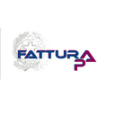

FatturaPA
=========

This module allows you to generate the fatturaPA XML file version 1.2
to be sent to the Exchange System

:no_entry: This module replaces l10n_it_fatturapa version [7-11].0.2.0.0 by OCA.

FatturaPA
=========

Questo modulo permette di generare il file xml della fatturaPA versione 1.2
per essere spedita al sistema di interscambio SdI.

:warning: Lo schema di definizione dei file xml dell'Agenzia delle Entrate, pubblicato
con urn:www.agenziaentrate.gov.it:specificheTecniche è base per tutti i file
xml; come conseguenza nasce un conflitto tra moduli diversi con lo stesso
schema di riferimento dell'Agenzia delle Entrate con l'errore:

:heavy_exclamation_mark: *name CryptoBinary used for multiple values in typeBinding*

Tutti i moduli che generano file xml per l'Agenzia delle Entrate *devono*
dipendere da questo modulo.
Per maggiori informazioni visitare il sito www.odoo-italia.org o contattare
l'autore.

Certificati

Ente/Certificato | Data inizio | Da fine | Note
--- | --- | --- | ---
[FatturaPA](http://www.fatturapa.gov.it/export/fatturazione/it/fattura_PA.htm) | 22-09-2017 | 31-12-2017 | 

Installation
------------

:warning: Since version [7-8].0.4.0.0 of this module, definition schemas are
moved into module l10n_it_ade. Please, read l10n_it_ade documentation for furthermore
informations.

:warning: A partire dalla versione [7-8].0.4.0.0 di questo modulo, gli schemi
di definizione sono stati spostati nel modulo l10n_it_ade. Per ulteriori
informazioni, leggete i documenti relativi al modulo l10n_it_ade.

This module requires PyXB 1.2.4 http://pyxb.sourceforge.net/

These instruction are just an example to remember what you have to do:

    pip install PyXB==1.2.4
    git clone https://github.com/zeroincombenze/l10n-italy
    cp -R l10n-italy/l10n_it_ade ODOO_DIR/l10n-italy/
    sudo service odoo-server restart -i l10n_it_fatturapa -d MYDB

From UI: go to Setup > Module > Install

Configuration
-------------

:it:

* Configurazione > Configurazione > Contabilità > Fattura PA :point_right: Impostare i vari parametri
* Contabilità > Configurazione > Sezionali > Sezionali :point_right: Impostare sezionale fattura elettronica
* Contabilità > Configurazione > Imposte > Imposte :point_right: Impostare natura codici IVA
* Contabilità > Clienti > Clienti :point_right: Impostare IPA, EORI (se necessario), nazione, partita IVA, codice fiscale

Usage
-----

For furthermore information, please visit http://wiki.zeroincombenze.org/it/Odoo/7.0/man/FI

Known issues / Roadmap
----------------------

:ticket: This module replaces l10n_it_fatturapa OCA module; PR have to be issued.

In order to use this module you have to use:

:warning: Use [l10n_it_base](l10n_it_base/) replacing OCA module

:warning: Use [l10n_it_ade](l10n_it_ade/) module does not exist in OCA repository

:warning: Use [l10n_it_fiscalcode](l10n_it_fiscalcode/) replacing OCA module

Bug Tracker
-----------

Have a bug? Please visit https://odoo-italia.org/index.php/kunena/home

Credits
-------

### Contributors

* Davide Corio
* Lorenzo Battistini <lorenzo.battistini@agilebg.com>
* Roberto Onnis <roberto.onnis@innoviu.com>
* Alessio Gerace
* Antonio M. Vigliotti <antoniomaria.vigliotti@gmail.com>

### Funders

Questo modulo è stato sviluppato con il contributo di

* Agile BG <https://www.agilebg.com/>
* SHS-AV s.r.l. <https://www.zeroincombenze.it/>

### Maintainer

Odoo Italia is a nonprofit organization whose develops Italian Localization for
Odoo.

To contribute to this module, please visit <https://odoo-italia.org/>.

[//]: # (copyright)

----

**Odoo** is a trademark of [Odoo S.A.](https://www.odoo.com/) (formerly OpenERP, formerly TinyERP)

**OCA**, or the [Odoo Community Association](http://odoo-community.org/), is a nonprofit organization whose
mission is to support the collaborative development of Odoo features and
promote its widespread use.

**zeroincombenze®** is a trademark of [SHS-AV s.r.l.](http://www.shs-av.com/)
which distributes and promotes **Odoo** ready-to-use on own cloud infrastructure.
[Zeroincombenze® distribution of Odoo](http://wiki.zeroincombenze.org/en/Odoo)
is mainly designed for Italian law and markeplace.
Users can download from [Zeroincombenze® distribution](https://github.com/zeroincombenze/OCB) and deploy on local server.

[//]: # (end copyright)

[//]: # (addons)

[//]: # (end addons)

